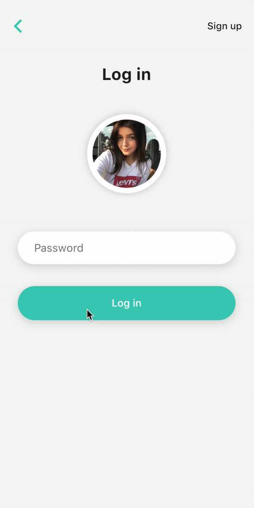

# Animated Progress Button


Animated loading button to make you app button looks smoother.
Take inspritation from Pinterest https://www.pinterest.com/pin/671177150707141229/




## Usages

Create `animatedButtonController` for controlling the button.

```sh
import 'package:...';

final AnimatedButtonController animatedButtonController = AnimatedButtonController();
```

Then customize the button like your own way
*Noted that you must call `animatedButtonController.completed()` after getting response from server in order to complete the button animation*

 ```sh
AnimatedButton(
    controller: animatedButtonController,
    color: Colors.greenAccent,
    text: 'Log in',
    loadingText: 'Loading',
    loadedIcon: Icon(Icons.check, color: Colors.white),
    onPressed: () async {
        /// calling your API here and wait for the response.
        await Future.delayed(Duration(seconds: 5)); // simulated your API requesting time.
        animatedButtonController.completed(); // call when you get the response
        await Future.delayed(Duration(seconds: 2));
        animatedButtonController.reset(); // call to reset button animation
    },
),
```
